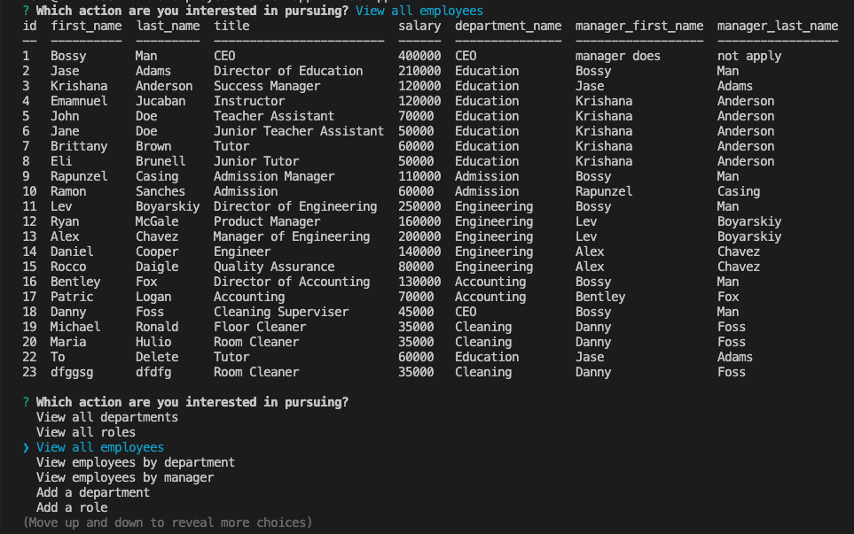
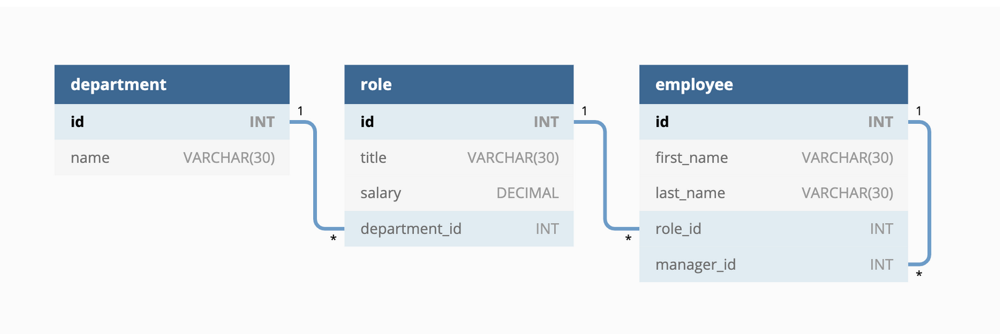

# Employee Tracker
[](https://opensource.org/licenses/MIT)    


--- 
> The Comand Line Employee Tracker app was developed as a component of the Berkeley Coding Bootcamp Challenge 12. Users can easily view, interact with, and modify employee information stored in a database by providing input in the command line. This enables them to manage and keep track of employee data with ease.
- The recorded [video](https://1drv.ms/v/s!Ak2qWe8ZT6ny2TYysoMloJ2fHQug?e=p1ViIv) on the screen demonstrates how the Employee Tracker application operates.

---
## Table of Contents
* [General Information](#general-information)
* [Preview](#preview)
* [Technologies Used](#technologies-used)
* [Installation](#installation)
* [Usage](#usage)
* [Features](#features)
* [Project Status](#project-status)
* [User Story](#user-story)
* [Acceptance Criteria](#acceptance-criteria)
* [Contact](#contact)
* [License](#license)

---
## General Information 
>The primary objective of the Employee Tracker is to improve the user experience by offering a way to interact with employee data. The development of the application was done accordingly to [user story](#user-story) and [acceptance criteria](#acceptance-criteria). 

---
## Preview 


---
## Technologies Used
-  JavaScript
-  Node.js v18.12.1
-  Inquirer v8.2.4
-  Mysql2 v3.2.3
-  Dotenv v16.0.3
-  Console.table v0.10.0

---
## Installation
>To use the `Employee Tracker`, the user must first [clone](https://github.com/UserOlena/employee-tracker-app) the repository to their local computer. Once the repository is successfully located on the computer, the user must install the necessary packages for the application to function. It is essential to have `node.js` installed on the computer, which can be downloaded from the official [web-site](https://nodejs.org/en). It is recommended to download `Node.js v18.12.1` since this application has only been tested with that version. Once `Node.js v18.12.1` is installed, the user should navigate to the `employee-tracker-app` repository using the command line by typing `cd ~/...` and replacing `...` with the path to the `employee-tracker-app` directory. Once in that directory, type `npm init -y` in the command line to install `node` modules, `npm i inquirer@8.2.4` to install the `inquirer` package, `npm i mysql2@3.2.3` to install the package that enable interaction with a database and `npm i console.table@0.10.0` to display the data in the tabular format. It is crucial to ensure that packages are installed within the `employee-tracker-app` directory, where `app.js` is located. Additionally user must provide their information to access the database. The file `connection.js` can be found inside the [config](./config/connection.js) folder. User must replace `process.env...` with their information in order to access the database. Finally, the user can call the application by typing `node app` in the command line.

---
## Usage
- To utilize the `Employee Tracker`, it is necessary to complete all the steps outlined in the Installation section.
- After completing the installation steps, the user can access the `Employee Tracker` by navigating through the command line to the `employee-tracker-app` directory where all the necessary `node` modules, the `inquirer` package, and the `app.js` file are located. They can then call the application by typing `node app` in the command line.
- When the user types `node app` in the command line and runs the `Employee Tracker`, the application will prompt them for input and their choice using a series of prompts. The `Employee Tracker` application is designed to be user-friendly. To operate the application, users can simply choose the desired option and provide the necessary input or select from the options presented by the prompt.

---
## Features 
- The application incudes the following functionality: 
    - Add a department
    - Add a role
    - Add an employee
    - Delete information:
        - Delete role
        - Delete department
        - Delete employee
    - Update employee's manager
    - View all roles
    - View all departments
    - View all employees
    - Update an employee role
    - View employees by department
    - View employees by manager
    - View the total utilized budget of a department
- `Add a department` option allows user to create a new department by proving new department name.
- `Add a role` option allows user to create a new role by providing a new role name, salary for that role and choosing an existing department from provided list.
- The `Add Employee` option enables users to create a new employee in the database. To create a new employee, users must provide the employee's first name, last name, choose a role, and select a manager from the provided lists. Once the user has provided all the required information, the new employee will be added to the database.
- The `Delete information` option in the Employee Tracker application enables users to delete specific information from the database. Users will be presented with an up-to-date list of roles, departments, and all employees to choose from. Once the user selects the information to delete, the application will remove the information from the database.
- The `Update Employee's Manager` option enables users to reassign the manager of a specific employee. Users are presented with an up-to-date list of employees and managers to choose from. Once the user selects the desired employee and manager, the application updates the employee's information in the database.
- The `View All Roles` option provides users with a comprehensive list of all roles in the database, including the role name, associated salary, and department name. Users can use this option to view and track all roles available in the organization.
- `View all departments` option provides users with a list of all departments and their IDs.
- The `View All Employees` option provides users with a comprehensive list of all employees in the database. The information includes the employee's ID, first name, last name, title, salary, department name, and their manager. Users can use this option to view and track all employees available in the organization.
- The `Update an Employee Role` option enables users to update an employee's role by selecting a new role from a provided list of all available roles. This option provides users with the ability to keep employee roles up-to-date and accurately reflect the current roles and responsibilities of each employee.
- The `View Employees by Department` option allows users to view all employees associated with a specific department by selecting the desired department from a provided list.
- `View employees by Manager` option allows users to view all employees associated with a specific Manager by selecting the desired Manager from a provided list.
- The `View the total utilized budget of a department` option enables the user to select a department and view the total budget utilized by that department in order to effectively manage the company's finances.
- To prevent the application from crashing when receiving invalid input, the `Employee Tracker` application includes a validation feature that ensures all user input matches the column types in the database. This helps to maintain the integrity of the application and the database.

---
## Project Status 
>Project is: Complete 

---
## User Story
```md
AS A business owner
I WANT to be able to view and manage the departments, roles, and employees in my company
SO THAT I can organize and plan my business
```  

---
## Acceptance Criteria
```md
GIVEN a command-line application that accepts user input
WHEN I start the application
THEN I am presented with the following options: view all departments, view all roles, view all employees, add a department, add a role, add an employee, and update an employee role
WHEN I choose to view all departments
THEN I am presented with a formatted table showing department names and department ids
WHEN I choose to view all roles
THEN I am presented with the job title, role id, the department that role belongs to, and the salary for that role
WHEN I choose to view all employees
THEN I am presented with a formatted table showing employee data, including employee ids, first names, last names, job titles, departments, salaries, and managers that the employees report to
WHEN I choose to add a department
THEN I am prompted to enter the name of the department and that department is added to the database
WHEN I choose to add a role
THEN I am prompted to enter the name, salary, and department for the role and that role is added to the database
WHEN I choose to add an employee
THEN I am prompted to enter the employee’s first name, last name, role, and manager, and that employee is added to the database
WHEN I choose to update an employee role
THEN I am prompted to select an employee to update and their new role and this information is updated in the database 
```  

### Additional Requarements
>Design the database schema as shown in the following image:



As the image illustrates, your schema should contain the following three tables:

* `department`

    * `id`: `INT PRIMARY KEY`

    * `name`: `VARCHAR(30)` to hold department name

* `role`

    * `id`: `INT PRIMARY KEY`

    * `title`: `VARCHAR(30)` to hold role title

    * `salary`: `DECIMAL` to hold role salary

    * `department_id`: `INT` to hold reference to department role belongs to

* `employee`

    * `id`: `INT PRIMARY KEY`

    * `first_name`: `VARCHAR(30)` to hold employee first name

    * `last_name`: `VARCHAR(30)` to hold employee last name

    * `role_id`: `INT` to hold reference to employee role

    * `manager_id`: `INT` to hold reference to another employee that is the manager of the current employee (`null` if the employee has no manager)

### Bonus

Fulfilling any of the following can add up to 20 points to your grade. Note that the highest grade you can achieve is still 100:

* Application allows users to update employee managers (2 points).

* Application allows users to view employees by manager (2 points).

* Application allows users to view employees by department (2 points).

* Application allows users to delete departments, roles, and employees (2 points for each).

* Application allows users to view the total utilized budget of a department&mdash;in other words, the combined salaries of all employees in that department (8 points).

---
## Contact
-  [Olena P](https://github.com/UserOlena)

---
## License
>This project is open source and available under the [MIT](./LICENSE)
